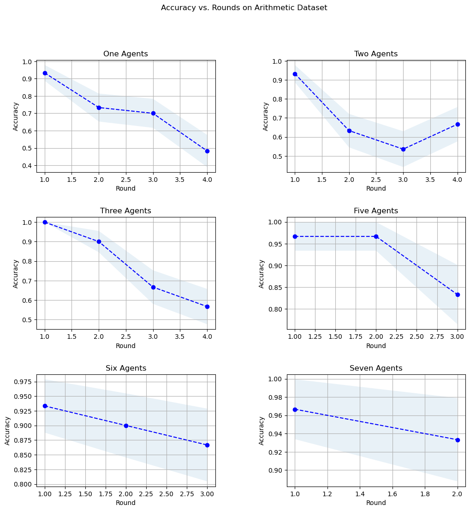
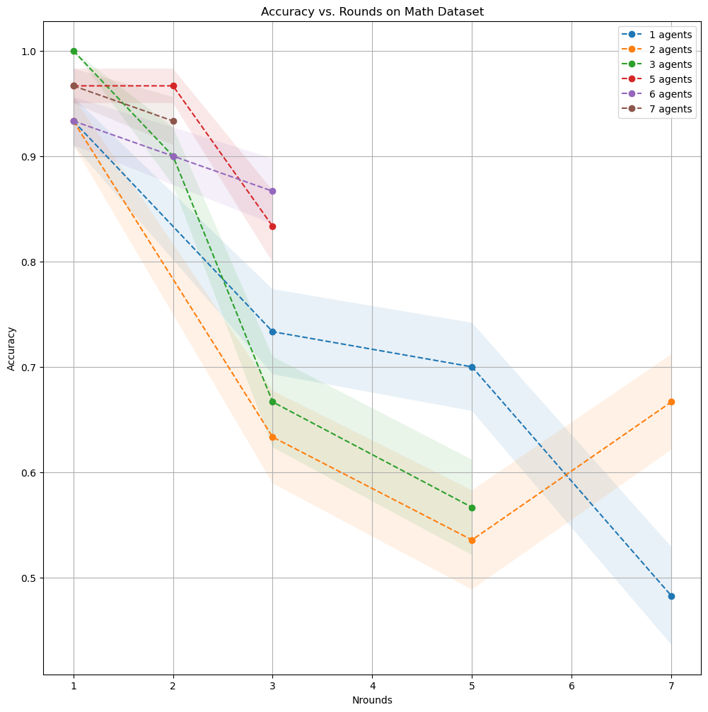
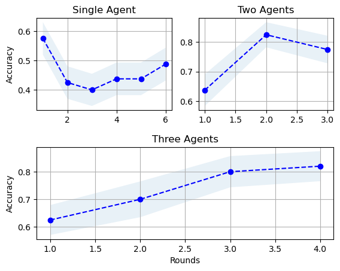

# Group Think and Collective Intelligence
## Debating Arithmetic between Multiple LLM Agents

## Intro Thoughts 

Did you know that if you connect multiple LLMs, and let them talk math (without restricting verbosity), the conversation becomes an ego-based sword battle?  At least this is what occured using [Llama-3](https://huggingface.co/meta-llama/Meta-Llama-3-8B-Instruct) and putting little restrictions on the LLM's output.  

(**Insert image / example of this**)

The intention of this research is to exploit the power of collective knowledge.  We know in our personal lives (and has been studied in Social Science too), that cooperative actors, perhaps 
each with a different set of knowledge or beliefs, can reach quality answers for difficult problems across a wide set of topics.  There is a tradeoff however, as too many actors can pollute the space with noise and ideas, making it difficult to attend to each and every argument.  This is the reason court jurys were lowered to 12 people, rather than 18.  This experiment looks to analyze this phenomena in LLMs.  

To preface, I was not able to reproduce the author's results, despite having followed their methodology for parsing responses.  I believe the results were confounded by the fact that the LLama models were particularly verbose, and as the input contexts quickly explode by iterating in rounds, the model's attention to the original instructions began to decrease.  Eventually, the agents were not following the instructions for how to respond in a way congruent with our instructions.  This should be resolvable to an extent, but I felt that I had to make sacrifices in how I allocated time to this problem set, and this stage of debugging was not as engaging as other parts of the assignment.  With that, let's begin! For these results we run 60 validation results to gauge the mean accuracy and std of the results. 

### Arithmetic / PEMDAS Experiments 

The original parsin strategy was to take the last number reported in the response.  Since we ask the model to "state your answer at the end", this should be sufficient, but after observing the aformentioned phenomena where the LLM's begin to challenge each other with new math problems, this system broke.  To try to resolve this, we decrease the allowable output length of the model to 200 tokens and explicitly ask "State your answer at the end of the response, and do not ask any questions!".  This dramatically helped, although as rounds progress, this sometimes began to break down again.  

The original paper employed the same PEMDAS operation each time to seed a debate.  I wanted to make the task more challenging and unpredictable because this is where collective knowledge becomes beautiful.  Rather than the standard PEMDAS operation from the paper, 

```
 a, b, c, d, e, f = np.random.randint(0, 30, size=6)
 answer = a + b * c + d - e * f
```

We randomize the order of operations
```
a, b, c, d, e, f = np.random.randint(0, 20, 6)
operators = ['+', '-', '*']*2
random.shuffle(operators)
equation = "{}{}{}{}{}{}{}{}{}".format(a, operators[0], b, operators[1], c, operators[2], 
                                       d, operators[3], e, operators[4], f)
```

Now lets run our [experiments](https://github.com/epirussky/Sak/blob/1b51f20999cbd143d7ec675c6228c567a4eae61a/Problem%203/math/gen_math_sky.py#L112) with the new implementation (and updated parsing to match LLamas output format ([code](https://github.com/epirussky/Sak/blob/1b51f20999cbd143d7ec675c6228c567a4eae61a/Problem%203/math/gen_math_sky.py#L79))).  **Note, because of memory requirements, my local machine was unable to perform many rounds of debate as the number of agents increase.  This is depeicted in the graphs below**



And lets plot these overlapped



We actually find a result that subverts the original paper's conclusion.  Accuracy decreases as rounds evolve.  Once again, I do have my fair share of suspicion here, and if I had more time would want to investigate whether the text pollution is causing the LLM behavior to divert from our instructions.  Perhaps we should re-introduce instructions more often.  

I wanted to gauge whether or not the agents were agreeing, even if they may have been reaching the wrong conclusion (does group-think exist here).  By sharply reducing the allowed output content of each LLM, and asking other agents whether or not they agree with the answer, I measured group agreement (mean agreement of all the one-to-many lists of each LLM). 


If you limit the LLMs from "showing their work" and ask them to agree / disagree in a concise response, agreement actually becomes higher as the rounds evolve (I wonder if different moodels have different... agreeableness?). 


### GSM Examples 

GSM are grades-school-math problem and require greater long-term reasoning than the arithmetic experiments.  We create some additional [experiment code](https://github.com/epirussky/Sak/blob/1b51f20999cbd143d7ec675c6228c567a4eae61a/Problem%203/gsm_experiment/experiment.py#L8) to allow experiments with varying parameters and update our experiment data.  As expected, we find decreasing performance. **INSERT LINK**  As expected this time, with the exception of the single agent case we see that performance increases with subsequent rounds.  GSM requires more intense reasoning, so rounds should increase performance as models have an opportunity to iterate on their thinking


**Accuracy vs. Rounds on GSM Dataset**


